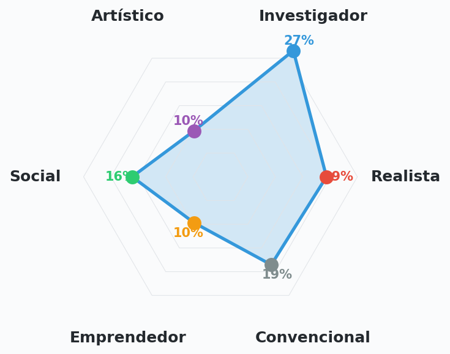
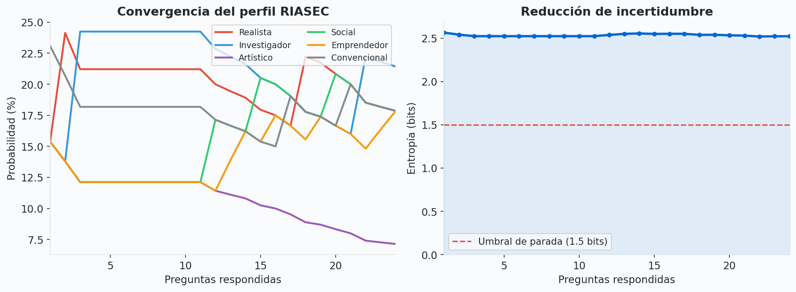
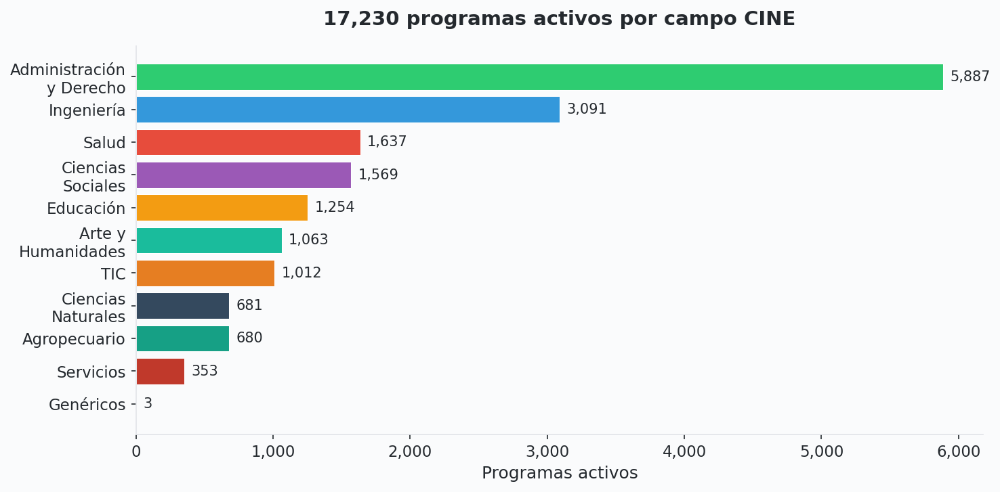
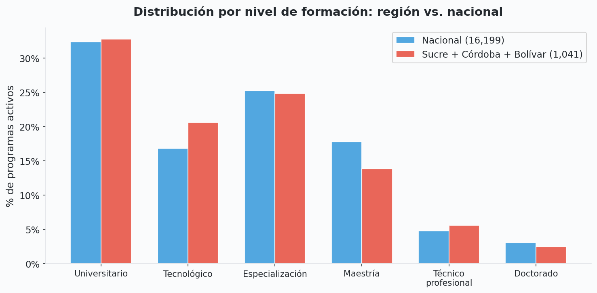
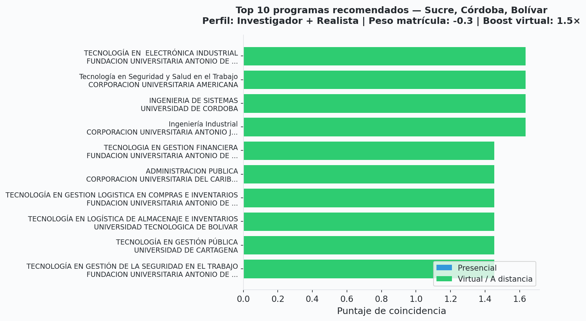

# riasec-co

**Bayesian adaptive RIASEC vocational guidance engine for Colombia.**

[Leer en español](README.md)

> **30,809** programs | **17,230** active | **297** institutions | **33** departments | **11** CINE fields

## Why This Exists

In Colombia, **choosing what to study** is a decision most students make with almost no guidance. Rural students in regions like San Jorge y La Mojana have no access to a career counselor, no assessment tools in Spanish, and no way to discover programs beyond the few universities they've heard of. The existing government tool (SNIES) is a raw database search — it tells you *what* exists, but not *what fits you*.

Meanwhile, the standard vocational framework used worldwide (Holland's RIASEC theory) has **zero open-source implementations** as installable packages on npm, PyPI, or CRAN. Every RIASEC app on the internet is a closed web form that gives you a letter code and nothing else.

`riasec-co` fixes both problems:

- **A real psychometric engine** -- not a toy quiz. Bayesian adaptive testing with Dirichlet posteriors, entropy-based stopping, and information-theoretic item selection. Fewer questions, more precise profiles.
- **Matched to real programs** -- every recommendation maps to an actual degree program in Colombia's SNIES catalog, with institution, department, modality, and tuition data.
- **Enrollment-weighted priors** -- the algorithm actively counteracts the oversaturation problem. Instead of recommending yet another Business Administration program (5,887 in the system), it surfaces Aquaculture, Environmental Science, and other fields where demand exceeds supply.
- **Three languages, one engine** -- TypeScript, Python, and R packages share the same data and produce the same results. Researchers can use the data in pandas/polars/tidyverse. Developers can embed the quiz in any app.
- **Fully open** -- public domain items (IPIP), public data (SNIES), MIT license. No vendor lock-in, no API keys, no paywalls.

This is the **first package combining vocational assessment with national education data**, in any country.

---

## At a Glance

<table>
<tr>
<td width="50%">

### Adaptive Quiz Profile

The Bayesian engine converges on a student's RIASEC profile in ~12 questions using entropy-based stopping.



</td>
<td width="50%">

### Adaptive Convergence

Profile probabilities stabilize and entropy drops as questions are answered. The quiz stops when uncertainty is low enough.



</td>
</tr>
</table>

### 17,230 Active Programs by CINE Field



### Regional Gap: Sucre + Cordoba + Bolivar vs. National

Only **1,091 programs** serve 3 departments with 3.5M+ people. The region has fewer graduate programs and more technical programs than the national average.



### Top 10 Recommendations for an Investigative Student

Enrollment-weighted priors downweight oversaturated fields (Administracion y Derecho: 5,887 programs) and boost smaller fields. Virtual programs get a 1.5x boost.



---

## Install

```bash
# TypeScript / JavaScript
npm install @riasec-co/core
npm install @riasec-co/react  # React components (optional)

# Python
uv add riasec-co              # or: pip install riasec-co

# R
remotes::install_github("afromero/riasec-co", subdir = "r")
```

## Usage: Three Languages, One Engine

All three packages share the same data and produce the same results.

### TypeScript

```typescript
import { createQuiz, loadPrograms, recommend } from '@riasec-co/core'

// 1. Run adaptive quiz
const quiz = createQuiz({ language: 'es', mode: 'adaptive' })
while (!quiz.isComplete()) {
  const q = quiz.nextQuestion()!
  const response = await askUser(q.text) // your UI
  quiz.answer(q.id, response)
}

console.log(quiz.profile())
// { R: 0.19, I: 0.27, A: 0.10, S: 0.16, E: 0.10, C: 0.18 }
console.log(quiz.topTypes(2)) // ['I', 'R']

// 2. Get recommendations
const results = recommend({
  profile: quiz.profile(),
  programs: loadPrograms(),
  filters: { departments: ['Sucre', 'Cordoba', 'Bolivar'], active: true },
  priors: { enrollmentWeight: -0.3, virtualBoost: 1.5 },
  limit: 10,
})

results.forEach((r, i) =>
  console.log(`${i + 1}. ${r.program.nombre_programa} (${r.score.toFixed(2)})`)
)
```

### Python

```python
from riasec_co import Quiz, Programs, recommend

# 1. Run adaptive quiz
quiz = Quiz(language="es", mode="adaptive")
while not quiz.is_complete:
    q = quiz.next_question()
    response = ask_user(q.text)  # your UI
    quiz.answer(q.id, response)

print(quiz.profile)
# {'R': 0.19, 'I': 0.27, 'A': 0.10, 'S': 0.16, 'E': 0.10, 'C': 0.18}
print(quiz.top_types(2))  # ['I', 'R']

# 2. Get recommendations (returns Polars DataFrame)
results = recommend(
    quiz.profile,
    departments=["Sucre", "Cordoba", "Bolivar"],
    enrollment_weight=-0.3,
    virtual_boost=1.5,
    limit=10,
)
print(results.select("nombre_programa", "nombre_institucion", "score"))

# 3. Researchers: just use the data
df = Programs.load()  # Polars DataFrame, 30,809 rows
df.filter(pl.col("departamento") == "Sucre").group_by("cine_amplio").len()
```

### R

```r
library(riasecco)

# 1. Access data directly
data(programs)   # 30,809 programs
data(items_es)   # 48 IPIP items (Spanish)

programs |>
  subset(departamento == "Sucre" & estado == "Activo") |>
  with(table(cine_amplio))

# 2. Run adaptive quiz
quiz <- create_quiz(language = "es")
while (!is_complete(quiz)) {
  q <- next_question(quiz)
  response <- ask_user(q$text)  # your UI
  answer(quiz, q$id, response)
}

profile(quiz)
# R: 0.19, I: 0.27, A: 0.10, S: 0.16, E: 0.10, C: 0.18

# 3. Get recommendations
results <- recommend(profile(quiz), departments = c("Sucre", "Cordoba"))
head(results[, c("nombre_programa", "nombre_institucion", "score")])
```

## How It Works

```
        Dirichlet Prior              Adaptive Item Selection        Entropy-Based Stopping
     alpha = (1,1,1,1,1,1)    -->   argmax E[KL(post || prior)]   -->   H(theta) < 1.5 bits?
              |                              |                               |
     Bayesian Update                  Next Question                  RIASEC Profile
     alpha_k += (r-1)/4              Most informative item          {R:.19 I:.27 A:.10 ...}
              |                              |                               |
              '-------------- loop ----------'                       Program Matching
                                                                     cosine(profile, CINE)
                                                                     x enrollment prior
                                                                     x regional boost
                                                                     x virtual boost
```

1. **Dirichlet prior** -- Uniform belief over 6 RIASEC types
2. **Adaptive selection** -- Picks the question that maximizes expected KL divergence
3. **Bayesian update** -- Each Likert response (1-5) updates the Dirichlet posterior
4. **Entropy stopping** -- Stops when Shannon entropy drops below threshold (~12 questions)
5. **Program matching** -- Cosine similarity between profile and CINE field vectors
6. **Enrollment priors** -- `log(N_total / N_field)` downweights oversaturated fields

## Key Stats

| Metric | Value |
|--------|-------|
| Total programs in SNIES | 30,809 |
| Active programs | 17,230 |
| Institutions | 297 |
| Departments | 33 (32 + Bogota D.C.) |
| CINE broad fields | 11 |
| Virtual/distance programs | 2,736 (15.9%) |
| Public sector | 6,446 (37.4%) |
| Private sector | 10,784 (62.6%) |
| IPIP items per language | 48 (8 per RIASEC type) |
| Adaptive quiz questions | ~12 (min 12, max 24) |

## Data Sources

| Source | What | Size |
|--------|------|------|
| [SNIES/HECAA](https://hecaa.mineducacion.gov.co/consultaspublicas/programas) | Complete Colombian higher education catalog | 30,809 programs, 39 fields |
| [IPIP](https://ipip.ori.org/) | Public-domain RIASEC interest markers | 48 items (en + es) |
| RIASEC-CINE Mapping | Holland types to CINE F 2013 AC broad fields | 16 weighted associations |

## Repository Structure

```
riasec-co/
├── data/canonical/           # CSV + JSON (single source of truth)
│   ├── programs.csv          # 30,809 programs, 24 columns
│   ├── items_en.json         # IPIP items (English)
│   ├── items_es.json         # IPIP items (Spanish)
│   └── mapping.json          # RIASEC → CINE weights
├── packages/
│   ├── core/                 # TypeScript engine (0 runtime deps)
│   └── react/                # QuizWidget, ProfileChart, ProgramCards
├── python/                   # Python package (Polars)
├── r/                        # R package (CRAN-ready)
├── scripts/                  # Data pipeline + showcase generation
└── .github/workflows/        # CI, monthly data refresh, npm/PyPI publish
```

## Development

```bash
# Data pipeline
npm install
npm run update-snies          # Parse SNIES Excel → programs.csv
npm run validate              # Validate all data files

# TypeScript
cd packages/core
npm install && npm run ci     # type-check + 41 tests

# Python
cd python
uv venv && source .venv/bin/activate
uv pip install -e ".[dev]"
pytest                        # 35 tests

# R
Rscript r/data-raw/generate.R
R CMD check r/
```

## References

- Holland, J. L. (1997). *Making vocational choices*. Psychological Assessment Resources.
- Liao, H.-Y., Armstrong, P. I., & Rounds, J. (2008). Development and initial validation of public domain Basic Interest Markers. *Journal of Vocational Behavior*, 73(1), 159-183.
- Armstrong, P. I., Allison, W., & Rounds, J. (2020). Alternate Forms Public Domain RIASEC Markers. *Electronic Journal of Research in Educational Psychology*.
- Nye, C. D., Su, R., Rounds, J., & Drasgow, F. (2012). Vocational interests and performance. *Perspectives on Psychological Science*, 7(4), 384-403.
- SNIES, Ministerio de Educacion Nacional de Colombia.
- IPIP: International Personality Item Pool.

See [METHODOLOGY.md](METHODOLOGY.md) for the full scientific methodology.

## License

MIT
